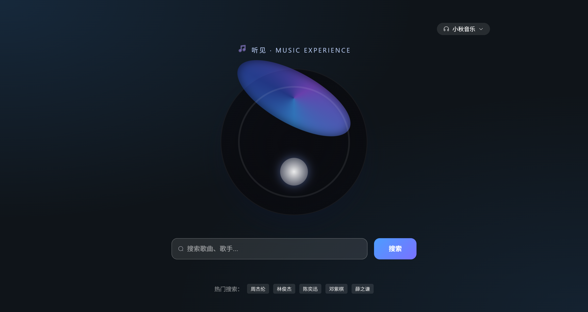

# 听见音乐（Music）

面向桌面端的多音源音乐播放器。前端以 Vue 3 + Element Plus 构建交互层，后端通过插件体系聚合第三方音源，为播放链接缓存、歌词解析、音频缓存等高频问题提供稳定解决方案。

## 📸 UI 预览



## ✨ 核心功能

- 🔍 **跨平台歌曲搜索**：通过插件统一调用不同音源，按歌名 / 歌手检索并补全封面信息。
- 🎧 **播放与歌单管理**：支持歌单轮播、平铺展示和 Hover 快速播放，桌面端体验友好。
- ♻️ **播放链接协商缓存**：`/api/play` 改为 GET + ETag，前端携带 If-None-Match，可直接返回 304，降低重复请求。
- 🎼 **歌词同步展示**：兼容多时间戳与缺省毫秒的 LRC 格式，结合播放进度实现逐行滚动。
- 💾 **音频缓存策略**：浏览器端利用 Cache Storage 与 Blob URL 缓存音频，重复播放无需再次下载。
- 🛡️ **音源插件管理**：后端自动下载、热更新第三方插件，并在失败时回退本地缓存，确保可用性。

## 🛠 技术栈

### 前端（`/client`）

- Vue 3 + TypeScript
- Pinia、Vue Router
- Element Plus、UnoCSS
- Axios、Vite

### 后端（`/server`）

- Express + TypeScript
- 插件化音源管理（Axios、Cheerio、Crypto-JS 等）
- 播放源缓存（ETag + TTL 内存兜底）

## 🚀 项目亮点 & 难点

- **多音源插件体系**：插件以内存 Map 管理，支持定时更新与失败回退，快速扩展音源生态。
- **播放链接可靠性设计**：GET + ETag 协同内存缓存，源站异常时仍可立即回退旧链接。
- **歌词解析兼容性**：逐行解析多时间标签，适配不同平台的 LRC 语法差异，保证滚动效果稳定。
- **前端缓存策略**：统一通过 `audioCache.ts` 请求音频，在受限环境下自动降级直连，体验与稳定性兼顾。
- **桌面端 UI 体验**：Hero 区黑胶动画、渐变视觉与卡片栅格，突出音源切换与快速操作。

## 📂 目录结构

```
├── client/      # Vue3 前端
├── server/      # Express 后端
├── api/         # 第三方音源插件目录
├── docs/ui/     # UI 截图
├── Bug.md       # 已知问题记录
└── README.md
```

## ⚙️ 快速开始

### 1. 克隆仓库

```bash
git clone https://github.com/YicoFighting/music.git
cd music
```

### 2. 安装依赖

```bash
# 前端
cd client
pnpm install

# 后端
cd ../server
pnpm install
```

### 3. 启动开发环境

```bash
# 启动后端（默认 http://localhost:3000 ）
pnpm dev

# 另一个终端启动前端（默认 http://localhost:5173 ）
cd ../client
pnpm dev
```

> 若需要 Git 代理，可参考 `Bug.md` 中的配置命令。

### 4. 构建发布

```bash
# 前端
cd client
pnpm build

# 后端
cd ../server
pnpm build
```

## ✅ 已完成清单

- [x] 多音源搜索与播放
- [x] 播放链接协商缓存（ETag + 304）
- [x] 歌词解析兼容性优化
- [x] 音频缓存与降级策略
- [x] 插件自动更新 / 失败回退

## 🔍 TODO

- [ ] 移动端适配与触控交互
- [ ] 更多播放模式（随机、心动等）
- [ ] 提供 Docker Compose 一键部署
- [ ] 增强播放器详情弹窗与桌面歌词

## 🙌 贡献指南

欢迎 Issue / PR：

1. 确保依赖安装、后端插件拉取成功。
2. 遵循 TypeScript + ESLint 规范，建议本地执行 `pnpm lint`。
3. UI 改动请附截图或预览链接。

## 📄 License

推荐使用 MIT License，如仓库尚未添加请补充。

---

如需新增音源适配或遇到问题，欢迎提交 Issue 交流，祝使用愉快！
